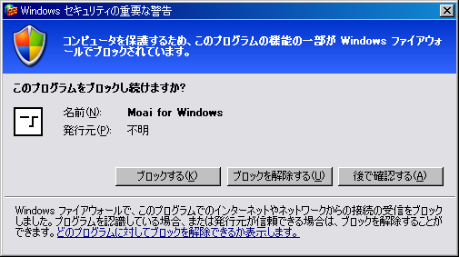
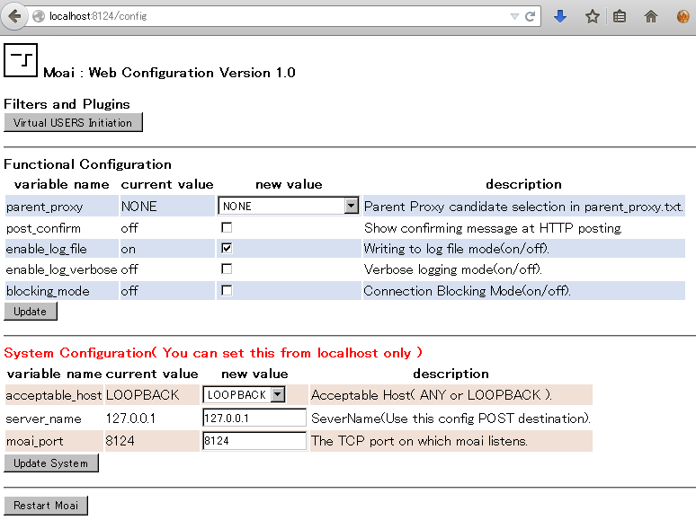

# Virtual USERS
-----------------------------------

## 目次
-----------------------------------
* [Virtual USERSとは？](#pos1)
* [何ができるのか？](#pos2)
* [Web閲覧時に送信される情報とは何なのか？](#pos3)
* [インストール/アンインストール方法](#pos4)
* [Virtual USERSの使い方](#pos5)
* [プロキシ設定ダイアログって何ぞ？](#pos6)
* [いっしょに含まれているmoaiとかhttp_decoratorとかZnkとかいうのは何なのか？](#pos7)
* [さらなる詳細](#pos8)
* [ライセンス](#pos9)
* [ご注意](#pos10)
* [免責事項](#pos11)

## <a name="pos1">Virtual USERSとは？
-----------------------------------

  Virtual User-agent Screen-size and Everything Randomize Systemの略.

  ネット上のサイトはあらゆる側面からあなたのマシン固有の情報を集め、あなた個人を識別しようと試みる.  
  Virtual USERSはブラウザと送信先のサイトとの通信を仲介し、IPを除くそれら全ての情報に関して、
  あなたの実際のマシン環境とは異なるバーチャルかつランダムな値へ変更した上でサイトへと送る.  
  これにより送信先はあなたを正しく識別できなくなる.  
  つまり早い話、これはよくあるあなたのプライベートを守るセキュリティーツールの一つである.  

## <a name="pos2">何ができるのか？
-----------------------------------

  これによりあなたはある種のネット上においては完全に別人として生まれ変わることが出来る.  
  また、場合によってはブラウザのCookieやJavascriptを無効にした状態でも掲示板にレス出来るという
  ほとんどの方にとって極めてどうでもよい副次的効果もある.  
  また**config.myf**内の**ignore_hosts**に通信をブロックしたいホストを記述しておくことで
  余計な通信を未然に防ぎ、結果的にあなたが普段よく見るサイトの表示を高速化するなど
  といったこともできる.  
  ブラウザが行う全HTTPを仲介しており、すべての通信内容をあなたへレポートする.  
  このレポートはターミナル(Windowsの場合コマンドプロンプトウィンドウ)において行われ、
  また**moai_log.log**というファイルにログとしても記録される.  

## <a name="pos3">Web閲覧時に送信される情報とは何なのか？
-----------------------------------

  以下の概念図を見てみよう.  

~~~
                          HTTPヘッダ
  あなたのブラウザ環境 === POST変数     ===> 送信先のサイト
                          クッキー
~~~

  これは一般に送信先サイトへ実際に何が送信されるかを示したものである.  
  送信先のサイトへはあなたのマシン固有の様々な情報が送信されるのであるが、
  それらはIPを除けばダイレクトに送信されるわけではなく、すべて上記にある３つの
  うちのいずれかの範疇にまずパックされて送信されるということだ.  
  (厳密に言えばクッキーも最終的にHTTPヘッダの範疇になるが、ここでは別枠とした)  

  たとえばふたばを例にとった場合、送信されるあなたのマシン情報とは

~~~
  1. IP  
    通常、プロバイダが割り当てたあなたの動的なIPアドレスである.  
    その場合、ルーカチ(以下、ルータのリセットの意味でこの言葉を使う)でこの値を
    変更可能である. その他、外部プロキシ、VPNを用いた場合はそのIPとなる.  

  2. User-Agent  
    簡単に言えば、あなたの使っているブラウザの識別名である.  
    この値はHTTPヘッダに格納された形で送信される.  

  3. posttimeおよびそれに類したふたばより発行される値  
    この値はふたばに初アクセスした時間(およびそれに類した値)である. 現状では
    カタログに初めてアクセスするか、または初めてレス投稿した際に設定されるようである.
    あるいは /bin/cachemt7.php にアクセスしたときにそれに類した値が生成される形となる.
    一旦設定されると、CookieおよびブラウザキャッシュおよびlocalStorage これら全てを
    消去しない限り同じ値が残り続ける. この値はPOST変数 pthb, pthc, (pthd) とCookieの
    posttime値として送信される.  

  4. SCreenSiZe  
    簡単に言えば、あなたの使っているモニタの解像度と色深度の情報である.
    (Javascriptにこれを取得するAPIがあり、これを利用しているようである)
    この値はPOST変数 scsz として送信される.  

  5. Fingerprint  
    この値はあなたのマシン環境の様々な情報を集めて文字列とし、それを元に32bit整数の
    ハッシュ値を計算したものである.この値はPOST変数 flrv, flvv として送信される.

    ハッシュ値が何のことかわからない方は、次のように考えればよい.
    例えばあなたのマシンの特徴を示す情報が３つあったとしてそれをそれぞれ仮に
    数字の 2, 4, 7 とする. これらを足し算して合計すると 2 + 4 + 7 = 13 となるが、
    この 13 がハッシュ値に相当しここではこれが送信される. 非常に大雑把だが、
    とりあえずそのようなイメージで十分である.

    ここでのポイントは 13 から元の値 2, 4, 7 を一意には復元できないということである.
    よってこの値は実のところデタラメに設定しても一般にその妥当性を検証する術はない.  
~~~

  お分かり戴けただろうか？  
  繰り返しになるが、上記はIPを除けば最終的にはHTTPヘッダ、POST変数、そしてCookieの値の
  いずれかとして送信される. そしてあなたがもし、そのとき送信されるこれらHTTPヘッダや
  POST変数やCookieを直接修正する術を持つなら、上記の値はすべて(ブラウザやモニタの解像度
  などのマシン環境を実際に変更することなく)自由に仮想環境を構築可能であるということだ.

  では具体的にどうやって仮想環境を構築するのか？
  実のところこれは手動でも可能であるし、プログラミングするにしてもそう難しい話でもないが
  Virtual USERSならばそれをすべて自動で行うことができ、楽ができる.

## <a name="pos4">インストール/アンインストール方法
-----------------------------------

  特にない.  
  同様にアンインストールのために特別必要なこともない.  
  レジストリなどへの書き込みやこのフォルダ配下以外への一時ファイルの作成などは一切行われない.  
  不必要になったらこのフォルダ毎削除すればよい.  

  ただ、Windowsであればvirtual_users.exeのショートカットなどを作り、デスクトップに置いておけば
  いつでも起動しやすくなりより快適であろう. これをさらにスタートアップに登録することで
  Windows起動時に自動的にこれが起動するように設定することもできる.  
  このツールはLinuxでも動作し、Linux用の実行用バイナリも一応同梱してあるが、
  ディストリビューションやそのライブラリのバージョン構成によっては動作しないということも有り得る.  
  必要なら[HowToCompile.txt][3]を見てもらいソースコードからコンパイルして戴きたい. 
  (Virtual USERSのソースコードは src/virtual_usersにある).

## <a name="pos5">Virtual USERSの使い方
-----------------------------------

  まず初めてVirtual USERSを使う場合は、以下の手順でサイトへアクセスできるかを確認しよう.

~~~
  1. virtual_users(Windowsならvirtual_users.exe)を起動する.

  2. ブラウザのプロキシ設定ダイアログでプロキシサーバとして localhost:8123 を指定する.
    (これでうまくいかない場合は 127.0.0.1:8123 で試してみよう!) 
    これは一般にループバック接続と呼ばれ、自分自身への接続を意味する.

  3. ブラウザから目的のサイトへアクセス！
~~~

  これで目的のサイトが無事表示されれば成功である.

  virtual_usersが起動している間は、あなたのマシン本来の姿がIPを除いて完全に隠蔽され、
  架空のマシン環境情報を送信する.   これによりブラウザのCookieやJavascriptを無効にしたまま
  掲示板などを閲覧することは勿論、レスやスレ立てをすることすら可能となり、非常にセキュアだ.  

> 現在デフォルトで仮想環境の構築をサポートしているサイトはふたばのみである.
> その他のサイトも一応閲覧は可能だが、仮想環境の構築まで行うには、そのサイト向けの
> filterやpluginを作成して追加しなければならない.

  もし「プロキシサーバへの接続を拒否されました」のような表示がなされた場合は
  おそらく 1 を起動していないか 2 の手順で何か指定をミスしている.  
  あるいはOSのファイアウォール機能により8123への接続がブロックされている可能性もあるので
  その設定を確認してみよう.  

  Windows XP以降の場合、次のようなダイアログが表示される場合がある.  
  

  ここで「ブロックする」を選んでも、このツールをローカルプロキシとして使う分には特に問題ない.  
  ただ、下記に述べる簡易Webサーバとしてこのツールを使う場合で、かつ他のLAN上のマシンからの接続をしたい場合は、このブロックを解除する必要がある.

  さて、Virtual USERSを介して別人に生まれ変わるには次のようにする.

~~~
  1. IPを変える(たとえばルーカチする).  

  2. virtual_users(Windowsならvirtual_users.exe)を起動する.  
     既に起動している場合は一旦終了し、もう一度起動する.  
~~~

  以上である.  
  尚、このときブラウザのクッキー等は消去する必要はない.  
  (した方が確実ではあるが必須ではない)

  **【おまけ】**  
  Virtual USERSは簡易Webサーバとしても機能する.  

  ブラウザのURL指定欄に http://localhost:8123 または http://127.0.0.1:8123 を指定してアクセスしてみよう.  
  Virtual USERSが起動していない場合は、このような指定は本来「サーバへの接続を確立できませんでした」といった
  エラーメッセージをブラウザが出すはずであるが、Virtual USERSが起動している場合、Welcome to Moai Web Server
  といったようなページが表示されるはずである.   ここからdoc_rootにあるファイルにアクセスしたり、
  簡易config画面などを出すことができる.  

  topページ  
  

  config画面  
  

  現状非常に貧相なものだが、将来のバージョンアップでこのあたりの機能の充実を図るかもしれない.  

## <a name="pos6">プロキシ設定ダイアログって何ぞ？
-----------------------------------

  プロキシを使ったことがある方なら、この項目を読む必要はない.
  使ったことありまへぇんな方でも、プロキシの設定方法に関してはググればいくらでも
  出てくるのでそちらをご覧戴きたいが、それで片付けるのもなんなので、以下では初心者の方
  向けにFirefoxを例にとって具体的な設定方法を一応説明する.

~~~
  1. 「ツール」メニューから「オプション」を選び、例の色々設定できる画面を開く.
  2. 「詳細」タブを選び、そこにある「接続設定」ボタンを押す.
  3. 「インターネット接続」というダイアログが出るので「手動でプロキシを設定する」
      という部分にチェックをつける.
  4.  すぐ下にある「HTTPプロキシ」の部分に localhost (または127.0.0.1) と入力する.
      また右隣にある「ポート」の部分に 8123 と入力する(このとき日本語入力はOFFにしておこう!)
  5.  同様にその下にある「SSLプロキシ」の部分に localhost (または127.0.0.1) と入力する.
      また右隣にある「ポート」の部分に 8123 と入力する(このとき日本語入力はOFFにしておこう!)
  6. virtual_usersを起動する.  
~~~

  以上である(先にvirtual_usersを起動させておいてもよい).

  **【重要】**  
  元の設定に戻す(プロキシを使用しない)方法も覚えておこう.
  上記 3. において「プロキシを使用しない」という項目が一番上にある.
  これにチェックをつけることで、Firefoxはプロキシを介さない通常の状態に戻る.
  (Firefoxの初期設定では元々この状態のはずである)

  もしvirtual_usersの方が何か変なことになった場合は、一度virtual_usersを終了して再び起動させればよい.
  万一閲覧しているサイトがどうしてもvirtual_usersを介した場合にうまく表示されないなど不具合が
  発生する場合は、ブラウザのプロキシ設定を元に戻した上で閲覧しよう.

## <a name="pos7">いっしょに含まれているmoaiとかhttp_decoratorとかZnkとかいうのは何なのか？
-----------------------------------

  Virtual USERSは我々のボスであるMr.Moai氏が開発したmoaiというローカルプロキシのラッパーであり、
  それを内部で呼び出す.
  また、DecoDecoBoy氏が酔った勢いで即興で書いた簡易HTTPクライアントhttp_decoratorも同様に呼び出す.
  libZnkは私ことZenkakuが開発したこれらをC言語で記述するための基本ライブラリである.
  そのため、これらがこのフォルダに含まれる.

  Virtual USERSはブラウザのクッキーやキャッシュなどを実際に消去したり、あなたのモニタの解像度を
  実際に変更したりなどといったことは勿論行わない. そうではなく通信の仲介役であるmoaiの
  フィルタを変更することによって、サイトへと送られる情報を改変し、そのような状況を仮想的に
  シミュレートしている.

  はるか上でVirtual USERSはブラウザと接続先サイトの通信の間に入ると書いたが、この仕事はほとんど
  moaiが行っている. またfiltersやpluginsには、moaiのフィルタや機能拡張のためのモジュールが
  格納されている.

  moai自体はどこのサイト専用というわけではなく、あらゆるサイトに使うことができる汎用のツール
  である.  Virtual USERSでは、moaiのフィルタやプラグイン機能を使って( 現時点ではfutaba向けの )
  モジュールを追加しており、moaiは単にそれを読み込んで動作している形となる. 必要なら
  新たなサイト向けのフィルタやプラグインをあなたが新しく作ってmoaiの機能を拡張することも
  できる.

## <a name="pos8">さらなる詳細
-----------------------------------

  Virtual USERSに関するさらなる詳細な使い方と付随情報を [README_more.txt][1] に記載しておいたので
  興味がある方は参照されるとよい.  
  moaiに関しての詳細を知りたい方は、src/moaiにある[README_jp.txt][2]を参照して戴きたい.
  ただしこれの説明はここにあるものより技術的な解説であり、少し難しいかもしれない.

## <a name="pos9">ライセンス
-----------------------------------

  **NYSL**(煮るなり焼くなり好きにしろ)である.  
  ( NYSLについては http://www.kmonos.net/nysl を参照. )  
  現時点での公式のソースリポジトリは https://github.com/mr-moai-2016/znk_project であるが
  再配布はご自由にどうぞ.

## <a name="pos10">ご注意
-----------------------------------

  以下はmoaiにあるReadme.txtの抜粋である.

  moaiは生まれたばかりのローカルプロキシでs(ry.
  公開するにあたってそれ相応のテストは行ってはいるが、まだまだ実績が浅いため、未知の
  不具合が発生する可能性もある(それゆえVersionを今現在0.8としてある). 特に重要な内容を
  伴う情報の通信を確実に行う必要がある場合においては、念のためmoaiの使用を控えた方がよい. 

  また、このプログラムはポート番号8123においてクライアントからの接続をリッスンする.
  (このデフォルトのポート番号はconfig.myfより変更することもできるが、その場合は
   8123をその番号で読み替えて欲しい). 
  ここで言う「クライアント」とは、あなたのマシン上に置かれたあなたの使うブラウザであり、
  それ以外のものは基本的には想定されていない.  moaiはローカルプロキシの名が示す通り、
  外部ネットワーク(WAN)からの不特定多数からの接続に関しては全く考慮されていない. 

  よってあなたがルータの設定を特別弄くっていない限りは通常は心配いらないことであるが、
  もしもお使いのルータでいくつかのポートへの外部からの接続をあなたが意図的に許可してあり、
  かつその許可ポートの中に8123が含まれる場合は、それを必ず閉じ、外部ネットワークからの
  moaiへの接続は確実に不許として置くこと.

## <a name="pos11">免責事項
-----------------------------------

  本ソフトウェアは「現状のまま」で、明示であるか暗黙であるかを問わず、
  何らの保証もなく提供されます. 本ソフトウェアの使用によって生じるいかなる損害についても、
  作者は一切の責任を負わないものとします.

  This software is provided 'as-is', without any express or implied warranty.
  In no event will the authors be held liable for any damages arising
  from the use of this software.

[1]: https://github.com/mr-moai-2016/znk_project/blob/master/src/virtual_users/README_more.md
[2]: https://github.com/mr-moai-2016/znk_project/blob/master/src/moai/README.md
[3]: https://github.com/mr-moai-2016/znk_project/blob/master/src/HowToCompile.md
