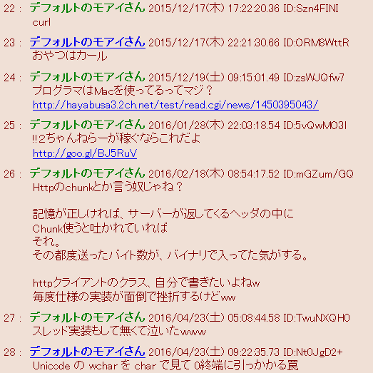

# Virtual USERS リファレンスマニュアル
-----------------------------------

## 目次
-----------------------------------
* [受信フィルタについて](#filter1)
* [外部プロキシを使いたい場合どうするのか？](#proxy1)
* [その他のローカルプロキシにチェーンする場合](#proxy2)
* [手動で偽装を行った場合(参考)](#note1)

## <a name="filter1">受信フィルタについて
-----------------------------------
Virtual USERSでは、HTTPにおけるGETにて受信されるHTMLやJavascriptやCSSにおいて
その受信文字列を自由に置換(replace)できるフィルター機能を備えている.  
これを指定しているのが、filters/<target_name>_recv.myf になる.
このファイル内の html_filter、js_filter、css_filterという部分で
それぞれHTML、Javascript、CSSにおける文字列の置換を行うことができる.
この部分にはfiltersコマンドと呼ばれる命令列を記述する.
現在サポートされているコマンドはreplaceのみで、以下の形式で記述する.

~~~
    replace ['置換前の文字列'] ['置換後の文字列']
~~~

これは「前者を後者で置換(replace)せよ」という命令になる.
これをhtml_filter内で書いておけば、<target_name>で指定されたホストにおいて
拡張子がHTMLのファイルのすべての行に対し、この文字列置換が行われる.
js_filter、css_filterについても同様である.

置換前の文字列と置換後の文字列は
必ず [' と '] というクォーティング記号で囲う必要があることに注意すること.
大抵の用途では、このクォーティング記号で問題は起こらないと思われるが
万一、置換対象文字列内にこの記号が含まれるなど、この記号だと都合が悪い場合は、
ファイルの最初の行にある @def_quote ディレクティブでこの記号を自由に変更することもできる.
例えば [' と '] の替わりに {' と '} を使いたいといった場合は、ファイルの一番最初の行に
~~~
    @def_quote {' '}
~~~
と書いておく.

**【例】**  
例えば掲示板「２ちゃんねる」を対象として、その受信HTMLとCSSを加工したいとしよう.
target.myf内で以下のように2chというtarget名を定義し、そこに「２ちゃんねる」の
ホスト名を列挙しておく.

~~~
@@L 2ch
hanabi.2ch.net
echo.2ch.net
penguin.2ch.net
@@.
~~~

filters/2ch_recv.myfというファイルを作成し、このファイル内で以下のフィルタコマンドを
指定する.

~~~
@@L html_filter
replace ['<b>デフォルトの名無しさん</b>'] ['<b>デフォルトのモアイさん</b>']
replace ['">デフォルトの名無しさん</a>'] ['">デフォルトのモアイさん</a>']
@@.

@@L css_filter
replace ['{background:rgb(239,239,239)}'] ['{background:rgb(240,224,214); color:rgb(127,0,0)}']
@@.
~~~

ファイルが作成できたら、Virtual USERSを起動(再起動)し、この状態で普通に「２ちゃんねる」へとアクセスする.
以下はその表示結果であり、HTMLの内容が加工されて名前欄の文字列が変更されている.
またCSSの内容が加工されて背景色と文字色が変更されている.

もしも正しく設定したにもかかわらず表示が変わらないなら、ブラウザのキャッシュに古い情報が残っている
可能性がある. キャッシュをクリアしてからもう一度目的のサイトへアクセスしよう.

## <a name="proxy1">外部プロキシを使いたい場合どうするのか？
-----------------------------------

  ブラウザのプロキシ設定ダイアログには既にlocalhost(127.0.0.1)を指定してしまっている.
  これでは外部プロキシを利用できなくなるので困るという方もおられよう.

  Virtual USERSでは次の接続仲介先として外部プロキシを設定することも一応できる.
  そのためにはコマンドラインから以下のように引数を与えて実行する

     virtual_users  外部プロキシのIP  外部プロキシのポート

  このときは、概念的に次のような接続になる.

  あなたのブラウザ環境 => ローカルプロキシVirtual USERS => 外部プロキシ => 送信先のサイト

  しかしIPアドレスを変えるだけなら通常はルーカチで十分であるし、そもそも有効な外部プロキシ
  を見つけること自体がかなり難しい. 尚、外部プロキシのサポートはまだ試験的なものであり、
  特にプロキシによっては通信が不安定になる場合もある. というわけでこの機能を使うのは
  初心者にはお勧めしない.

## <a name="proxy2">その他のローカルプロキシにチェーンする場合
-----------------------------------

  Virtual USERSはその他のローカルプロキシと併用することもできる.
  例えばPolipoとのコラボも可能であることを確認している.
  これによってPolipoとVirtual USERSの恩恵を同時に享受できる.
  概念的に次のような接続になる.

  あなたのブラウザ環境 => ローカルプロキシVirtual USERS => ローカルプロキシPolipo => 送信先のサイト

  あるいは以下のように順番が逆でも可能である.

  あなたのブラウザ環境 => ローカルプロキシPolipo => ローカルプロキシVirtual USERS => 送信先のサイト

  設定手順は外部プロキシを指定する場合と全く同様に行える.
  おそらくデフォルトではPolipoとVirtual USERSは同じポートを使っているので、これらが異なるように
  変更しなければならない. 例えばPolipoのポートはデフォルトの8123のままとして、
  Virtual USERSの使用ポートを8122に変えるなどする(config.myf 内のmoai_portの値を変えればよい).

## <a name="note1">手動で偽装を行った場合(参考)
-----------------------------------

  参考のため、Virtual USERSのようなツールを使わず、手動で偽装する方法も記載しておいた.
  以下のはふたばの例であるが、このような偽装を全て漏れなく手動でやろうとした場合、
  以下のようにかなりの手間となる.

~~~
  1. ブラウザで開いているふたば関係のタブを一旦閉じる.
     これによりうっかりPOST変数などが残留してしまう可能性を排除する.
     キャッシュを消してもこれが消えずに残る場合もあるため一旦閉じた方が確実だろう.

  2. ルーカチする.

  3. ブラウザのクッキー、キャッシュ、localStorageを消去.
     localStorageの消去についてはブラウザ毎に異なるが、Firefoxの場合
     「オフラインWebページとユーザデータ」とある部分で「今すぐ消去」ボタンを押す.

  4. User-Agentの値を変更する. 
     最も安直な方法は、使うブラウザを変更することである.
     あるいは使ってるブラウザにUser-Agent偽装アドオンなどが存在するならそれを入れて
     別の値に設定する.

  5. 新しいタブを開いた上で1で閉じたふたば関係のページなどに再度アクセスする.
     逆に言えばこの段階になるまでは、まだふたば関係のページを開いてはいけない.

  6. モニタの解像度や色深度を変更する.
     最も安直な方法は、モニタのプロパティより解像度と色ｓ…
     …というか、たかがふたばのためにこんなことまで実際にはやってられないので、
     ここは以下にある「POST変数を手動で修正する方法」によって、POST変数scszを直接変更する.

  7. POST変数 flrv, flvv(Fingerprint)の値を変更する. 
     flrvはUser-Agentを変更すればその値も変わる.
     一方、最近導入されたflvvはUser-Agentを変更しても変わらない.
     よって以下にある「POST変数を手動で修正する方法」によって、POST変数flvvを直接変更する.
     値は32bit整数なら何でもよい.
     (ついでにflrvも直接変更しておけばよかろう. ただしflvvとは異なる32bit整数値にしておく)

  8. jsの値をonに変更する. 
     最も安直な方法は、女子小学生へonして変態すｒ…
     ではなく、この値はJavaScriptを実行したかどうかを判断するためのものであり、
     /bin/base4.js を実行すると on に設定される仕組みとなっている.
     これを on にしておかないと「環境変数がありません(JavaScriptがオフ？)」という
     エラーが表示され、投稿に失敗する.
     よって以下にある「POST変数を手動で修正する方法」によって、POST変数jsの値をonに変更する.

  9. レス投稿またはスレ立て.
     「Cookieを有効にしてください」と出る場合は、もう一度投稿.
      本当にCookieを無効にしていない限りは、2回目はうまくいくはずである.
~~~

#####  ※ POST変数を手動で修正する方法
~~~html
     Step1.
       まずスレのHTMLを保存する

     Step2.
       次に保存したスレのHTMLをテキストエディタ(メモ帳など)で開き、
       その中身を直接書き換えて修正する
        などと書かれた部分があるはずである
       ぶっちゃげこのbase4.jsが邪悪の元凶であり、コイツが忌々しい数々の変数の値を設定している.
       そしてこのままでは base4.js を実行してしまうので、これが実行されないよう、この部分を削除する.

     Step3.
       後は <input type=hidden…> などと書かれている部分を好き放題変えればよいのだが、
       例えばflrvならば、

          <input type=hidden id="flrv" name="flrv" value="">

       などと書かれてあるが、この部分を

          <input type=hidden id="flrv" name="flrv" value="77777777"> 

       とすれば晴れてflrvの値を77777777に偽装できる.

     後は修正したHTMLをダブルクリックして、表示される投稿フォームから投稿すれば
     上において偽装された値が送信されることだろう.
~~~

